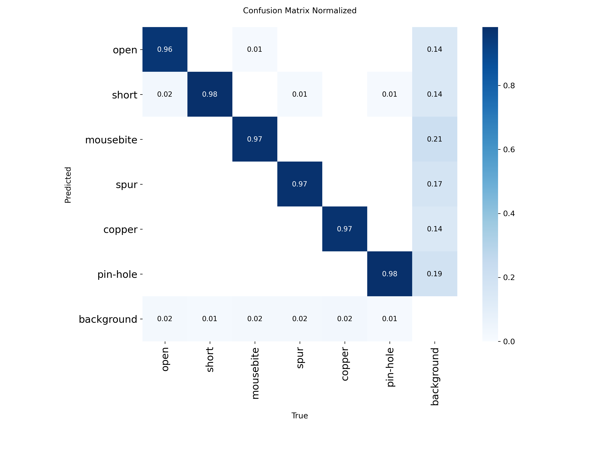

# Vision-Scan: Neural Vision Pipeline for PCB Anomaly Detection

Automated visual inspection of Printed Circuit Boards using deep learning. Detects six classes of manufacturing defects (open, short, mousebite, spur, copper, pin-hole) on the DeepPCB benchmark, reaching **0.983 mAP@0.5** at **99 FPS** on a single NVIDIA T4 GPU.

## Why this matters

PCB inspection is the bottleneck in modern electronics manufacturing. Manual microscope inspection misses over 20% of defects on high-volume lines, and rule-based Automated Optical Inspection (AOI) systems generate so many false positives that operators end up running secondary manual reviews anyway. Deep learning offers a path past both limits, but the published research rarely ships a deployable artifact: training notebooks without exported weights, accuracy numbers without latency measurements, and benchmarks without reproducibility. Vision-Scan closes that gap.

## What it does

The pipeline runs in three stages:

1. **Synthetic augmentation** — expands a 1,050-image training set roughly four-fold using rotation, flipping, brightness shifts, Gaussian noise, and Gaussian blur. Bounding boxes are transformed consistently with the images so detection labels stay valid.
2. **YOLOv8 fine-tuning** — transfer-learns a YOLOv8s detector from COCO-pretrained weights using AdamW, mixed-precision FP16 training, and cosine learning rate decay. Early stopping triggers when validation mAP plateaus.
3. **ONNX export** — converts the trained PyTorch weights to ONNX with opset 12 and graph simplification, producing a portable model that runs on CPU, CUDA, or OpenVINO targets through ONNX Runtime.

Every stage produces inspectable artifacts. Every metric reported in the paper has a script that generates it. The full pipeline runs end-to-end on a single Kaggle T4 notebook in under three hours.

## Tech stack

PyTorch 2.10 · Ultralytics YOLOv8 · Albumentations · ONNX Runtime · OpenCV · DeepPCB dataset

## Project context

Final project for CS 7367 Machine Vision at Kennesaw State University, Spring 2026. The full IEEE-format report is available in [`docs/Vision_Scan_Report.pdf`](docs/Vision_Scan_Report.pdf).

---

## Results

Trained on the DeepPCB dataset (1,500 images, 6 defect classes) with 50 epochs of YOLOv8s fine-tuning on an NVIDIA T4 GPU.

| Metric | Value |
|---|---|
| **mAP@0.5** | **0.983** |
| mAP@0.5:0.95 | 0.627 |
| Precision (mean) | 0.979 |
| Recall (mean) | 0.948 |
| Inference speed (PyTorch, T4 GPU) | 99.3 FPS |

### Per-class performance

| Class | Precision | Recall | mAP@0.5 |
|---|---|---|---|
| open | 0.974 | 0.960 | 0.987 |
| short | 0.964 | 0.909 | 0.965 |
| mousebite | 0.992 | 0.966 | 0.984 |
| spur | 0.972 | 0.934 | 0.976 |
| copper | 0.988 | 0.958 | 0.992 |
| pin-hole | 0.986 | 0.960 | 0.993 |

### Confusion matrix



The diagonal entries (0.96–0.98) show the model rarely confuses one defect class for another. The dominant residual error is missed detection (predicted as background), suggesting that recall improvements would be the right next step.

---

## Tools and Frameworks

**Core stack**
- Python 3.12
- PyTorch 2.10 (with CUDA 12.8)
- Ultralytics YOLOv8 (8.4.46)
- OpenCV 4.8
- Albumentations 1.3 — bounding-box-aware augmentation
- ONNX 1.20 + ONNX Runtime 1.25 — portable deployment

**Compute**
- NVIDIA Tesla T4 GPU via Kaggle Notebooks (15 GB VRAM)

**Dataset**
- DeepPCB by Tang et al. — 1,500 paired template/test images with 6 defect classes
- 70/15/15 train/val/test split

---

## Machine Learning Concepts

- **Object detection** — bounding-box regression + classification
- **Transfer learning** — fine-tuning from COCO-pretrained YOLOv8s weights
- **Synthetic data augmentation** — geometric (rotation, flip, affine) and photometric (brightness, noise, blur) operators
- **Anchor-free detection** — YOLOv8's decoupled detection head
- **Multi-scale prediction** — three feature scales for detecting defects ranging from a few pixels to hundreds
- **Distribution focal loss + binary cross-entropy** — composite loss for box regression and classification
- **AdamW optimizer with cosine annealing** — decoupled weight decay with smooth learning rate schedule
- **Mixed-precision (FP16) training** — fits batch size 16 into T4 memory
- **Early stopping** — validation-based with 30-epoch patience
- **Confusion matrix analysis** — diagnostic decomposition of residual error
- **ONNX model export** — runtime-portable deployment format

---

## Project Structure
vision-scan/
```
├── README.md
├── requirements.txt
├── docs/
│   └── Vision_Scan_Report.pdf      # Final IEEE-format project report
├── configs/
│   └── deeppcb.yaml                # YOLO dataset config
├── scripts/
│   └── prepare_deeppcb.py          # DeepPCB → YOLO format converter
├── src/
│   ├── augment.py                  # Stage 1: synthetic augmentation
│   ├── train.py                    # Stage 2: YOLOv8 fine-tuning
│   ├── evaluate.py                 # mAP, precision, recall, per-class
│   ├── export.py                   # ONNX export
│   └── benchmark.py                # FPS measurement
└── runs/detect/vision_scan/
    ├── results.csv                 # Per-epoch training metrics
    ├── confusion_matrix.png
    ├── confusion_matrix_normalized.png
    └── weights/
        ├── best.pt                 # Trained PyTorch weights
        └── best.onnx               # ONNX deployment model
```
---

## Reproduce the Results

```bash
# Install dependencies
pip install -r requirements.txt

# Get dataset
git clone https://github.com/tangsanli5201/DeepPCB.git

# Convert to YOLO format
python scripts/prepare_deeppcb.py --source DeepPCB/PCBData --output data/deeppcb_yolo

# Augment training data
python src/augment.py \
    --input data/deeppcb_yolo/images/train \
    --labels data/deeppcb_yolo/labels/train \
    --output data/deeppcb_yolo/augmented \
    --multiplier 3

# Train (~1 hour on T4 GPU)
python src/train.py --data configs/deeppcb.yaml --epochs 100

# Evaluate
python src/evaluate.py --weights runs/detect/vision_scan/weights/best.pt --data configs/deeppcb.yaml

# Export and benchmark
python src/export.py --weights runs/detect/vision_scan/weights/best.pt
python src/benchmark.py --weights runs/detect/vision_scan/weights/best.pt
```

---

## Author

**Kokou Adje**
M.S. student in AI / Computer Vision
College of Computing and Software Engineering, Kennesaw State University
kadje@students.kennesaw.edu

---

## Acknowledgments

DeepPCB dataset by Tang et al. (arXiv:1902.06197). Pretrained weights from Microsoft COCO. Built with Ultralytics YOLOv8 and Albumentations.
